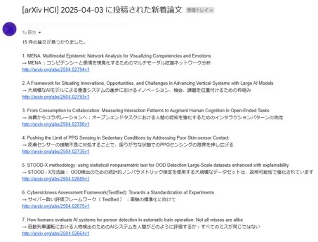

# arXiv HCI Daily Notifier 📬

このプロジェクトは、[arXiv](https://arxiv.org/) の Human-Computer Interaction（`cs.HC`）カテゴリから  
**前日に投稿された論文のタイトルと URL を自動取得し、日本語訳付きで Gmail に通知**する Python スクリプトです。

## 📬 HCI 論文通知サンプル



## 🛠 主な機能

- 直近 24 時間に投稿された論文だけを対象に抽出
- 英文タイトルを日本語に自動翻訳（`translate` ライブラリ使用）
- 件数を明記した読みやすい通知
- 毎日自動実行（`cron`）対応
- ログ保存オプション付き

## 🔧 使用技術・ライブラリ

- Python 3.x
- [feedparser](https://pypi.org/project/feedparser/)
- [yagmail](https://pypi.org/project/yagmail/)
- [PyYAML](https://pypi.org/project/PyYAML/)
- [translate](https://pypi.org/project/translate/)
- [python-dateutil](https://pypi.org/project/python-dateutil/)

```bash
pip install -r requirements.txt
```

## 📁 ファイル構成

```bash
arxiv-hci-daily/
├── fetch_arxiv_hci.py       # メインスクリプト
├── config.yaml              # メール送信設定（Gmail、件数）※Gitに含めない
├── example_config.yaml      # 設定ファイルのサンプル
├── requirements.txt         # 使用ライブラリ一覧
├── .gitignore               # 機密情報を除外
└── README.md                # このファイル
```

## 設定ファイル（config.yaml）

```yaml
gmail_user: "your_email@gmail.com"
gmail_app_password: "your_app_password"
to_email: "your_email@gmail.com"
max_results: 50
category_code: "cs.HC"
category_name: "HCI"
```

gmail_user と to_email が同じでも問題ありません。

### 他分野への応用

このツールは `cs.HC`（Human-Computer Interaction）カテゴリーに特化していますが、**arXiv の他の研究分野にも簡単に応用可能です**。
例えば、以下のようなカテゴリーに変更するだけで他分野の論文通知にも対応できます：

| category_name        | category_code |
| -------------------- | ------------- |
| 機械学習             | `cs.LG`       |
| 人工知能             | `cs.AI`       |
| コンピュータビジョン | `cs.CV`       |
| 音声・言語処理       | `cs.CL`       |
| ソフトウェア工学     | `cs.SE`       |
| ロボティクス         | `cs.RO`       |
| 医用画像             | `eess.IV`     |
| 量子物理学           | `quant-ph`    |

## ✉️ Gmail アプリパスワードの設定

このスクリプトでは Gmail 経由でメール通知を行うために、
**「アプリ パスワード（App Password）」の設定が必要です**。

### 🔐 設定手順

1. [Google アカウント](https://myaccount.google.com/) にログイン
2. 左メニュー「セキュリティ」へ移動
3. 「2 段階認証プロセス」を **ON にする**
4. 再度セキュリティページに戻り、「アプリ パスワード」を開く
5. 「アプリを選択」→「その他（名前を入力）」→ 例：`arxiv_hci_notifier`
6. 表示された **16 桁のパスワードを `config.yaml` に貼り付ける**

## 毎日自動実行する（cron 設定）

WSL 上で cron を起動（必要に応じて .bashrc にも追加）：

```bash
sudo service cron start
```

crontab -e を実行し、以下を追記：

```bash
0 8 * * * /usr/bin/python3 /home/yourname/arxiv-hci-daily/fetch_arxiv_hci.py >> /home/yourname/arxiv-hci-daily/cron.log 2>&1
```

→ 毎朝 8:00 に実行

## テスト実行

```bash
python3 fetch_arxiv_hci.py
```

## ライセンス

MIT License
